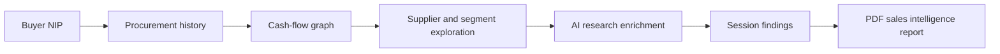

# Where is my money?

Public procurement sales intelligence for internal sales teams.

## What This Repository Is

This repository describes the product concept and operating model for **Where is my money?**.

There is no production code here. The goal is to show the product logic: what problem the tool solves, how the workflow behaves, how public procurement data becomes a relationship map, how AI research enters the session, and how the final report is produced.

## What Is Not Included

This repository does not include production source code, credentials, customer data, internal deployment configuration, company infrastructure details, proprietary prompts, or production report templates.

## Why This Exists

Public procurement data is available, but it rarely answers the sales question directly.

A salesperson does not only need to know that a tender happened. They need to know where the money repeatedly goes, who already owns the relationship, whether the account is locked by a few suppliers, and whether there is still a realistic way in.

That is the core question behind the product:

> Where does this buyer's money go, who receives it, and what should I do with that knowledge?

## Product Summary

The first product path starts from a buyer NIP and builds an account intelligence view around that public entity.

The first useful answer is simple:

```text
buyer -> winning suppliers -> tenders -> delivered products/services -> value over time
```

From there, the user can drill into suppliers, expand to a region or segment, run AI-assisted public research against the current board, and export the session into a PDF report.

The product is not trying to be another tender search engine. It is built around network intelligence: making buyer-supplier-money relationships readable enough for a salesperson to decide what to do next.

## Core Workflow



## First User Journey

The first path is deliberately buyer-centric.

1. A salesperson enters a buyer NIP.
2. The product loads historical procurement activity for that entity.
3. The user sees what the buyer purchased, how often, for how much, and from whom.
4. A dynamic graph shows the cash-flow network between the buyer, suppliers, tenders, categories, and technologies.
5. The user expands the view to supplier, region, or segment level.
6. AI enrichment uses the current board as context, instead of starting from a blank prompt.
7. The session becomes a PDF sales intelligence report.

## Product Layers

### Procurement Intelligence

Atlas Przetargow is the first working data layer. It gives the product a practical path into BZP and TED-based procurement data without rebuilding the entire aggregation stack first.

The hard part is not only fetching tenders. The hard part is not misleading the user: notices, procedures, results, and wins are different things, and the product has to keep those meanings separate.

### Network Intelligence

The graph is the working surface, not decoration.

Tables are still needed for precision, but the graph is where the sales pattern becomes visible: concentrated suppliers, recurring relationships, category overlap, regional dominance, and possible partner paths.

### AI Research Enrichment

AI receives the current board: selected buyer, visible suppliers, tender summaries, categories, values, and relationship patterns.

The prompt decides what to research and what evidence is required. The system keeps procurement facts separate from web findings, hypotheses, and recommendations.

### Reporting

The report follows the session. A buyer-focused session creates a buyer intelligence report. A supplier or segment-focused session produces a report around that context.

The output is meant to be used before a sales conversation, not archived as generic analysis.

## Reader Path

If you want the shortest path through the repository:

1. Start with [Product Overview](docs/PRODUCT_OVERVIEW.md).
2. Read the [Core User Journey](docs/USER_JOURNEY.md).
3. Review the [Example Analysis Session](docs/EXAMPLE_ANALYSIS_SESSION.md).
4. Check the [Data Flow](docs/DATA_FLOW.md).
5. Review the [Network Intelligence Model](docs/NETWORK_INTELLIGENCE_MODEL.md).
6. Review the [AI Research Layer](docs/AI_RESEARCH_LAYER.md) and [AI Trust Model](docs/AI_TRUST_MODEL.md).
7. Finish with [Product Metrics](docs/PRODUCT_METRICS.md), [Product Roadmap](docs/PRODUCT_ROADMAP.md), and [Product Operations](docs/PRODUCT_OPERATIONS.md).

## Documentation

- [Product Overview](docs/PRODUCT_OVERVIEW.md)
- [Core User Journey](docs/USER_JOURNEY.md)
- [Example Analysis Session](docs/EXAMPLE_ANALYSIS_SESSION.md)
- [Data Flow](docs/DATA_FLOW.md)
- [Network Intelligence Model](docs/NETWORK_INTELLIGENCE_MODEL.md)
- [AI Research Layer](docs/AI_RESEARCH_LAYER.md)
- [AI Trust Model](docs/AI_TRUST_MODEL.md)
- [Reporting Model](docs/REPORTING_MODEL.md)
- [Sample Report Structure](docs/SAMPLE_REPORT_STRUCTURE.md)
- [Product Metrics](docs/PRODUCT_METRICS.md)
- [Product Roadmap](docs/PRODUCT_ROADMAP.md)
- [Product Operations](docs/PRODUCT_OPERATIONS.md)
- [Product Decisions](docs/PRODUCT_DECISIONS.md)
- [Source Strategy](DATA_SOURCES.md)

## Scope

This repository describes a focused product concept, the core user workflow, and the intended evolution path. Production implementation details are intentionally out of scope.
