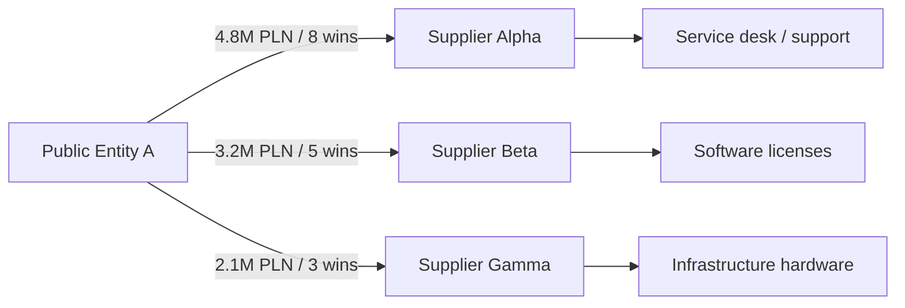

# Example Analysis Session

This walkthrough uses fictional names and values. It shows how the first release is meant to feel in use.

## Scenario

A salesperson is preparing for a first conversation with a public-sector buyer.

They are not looking for a list of tenders. They are trying to understand the account:

- what the buyer has purchased,
- which suppliers keep appearing,
- whether the relationship map is concentrated,
- where a competitor may already be embedded,
- and what questions are worth asking in the first meeting.

## 1. Start From Buyer NIP

The session begins with a buyer NIP.

```text
Input: buyer NIP
Time range: last 24 months
Initial focus: IT-related purchases
```

The product loads procurement history and builds a buyer profile.

## 2. Buyer Profile Output

The first screen gives a quick account read:

```text
Buyer: Public Entity A
Total notices: 148
Result notices: 54
Estimated awarded value: 18.4M PLN
Top categories: IT services, hardware, software licenses, maintenance
Most active period: Q4
```

This is also where the product has to be careful. Notice count, result count, awarded value, and supplier wins are different things. If they are mixed together, the salesperson gets a confident but misleading picture.

## 3. Cash-Flow Graph

The first graph shows where the money appears to go:



This is the first decision point. If one supplier dominates the graph, the account may be difficult to enter directly. If the network is fragmented, there may be more room for a targeted approach.

## 4. Supplier Drill-Down

The user clicks Supplier Alpha.

The product shows where else this supplier wins, what categories they deliver, how often they appear in the region, and whether their work overlaps with the user's offer.

The sales question becomes sharper:

> Is Supplier Alpha a direct competitor in this account, or could they be a partner for a non-overlapping part of the stack?

## 5. Region Expansion

The user expands from one buyer to the region.

Now the product shows which public buyers spend most, which suppliers dominate IT-related procurement, which categories repeat, and whether the selected account is unique or part of a broader pattern.

This step matters because sales strategy changes when an account is not isolated. A supplier that looks dominant in one buyer may be only one of many players in the region.

## 6. AI Research Enrichment

The user chooses a prompt:

```text
Prompt: Supplier partnership scan
Question: Based on the current graph, identify which suppliers may be partnership candidates rather than direct competitors.
```

The AI receives the current board: buyer, visible suppliers, tender summaries, category signals, values, time range, graph layer, and prompt requirements.

It then researches public web sources according to the prompt.

## 7. Example AI Finding

The AI returns a structured finding:

```text
Finding type: hypothesis
Subject: Supplier Alpha
Observation: Supplier Alpha appears strong in managed services and support, but the procurement history does not show evidence of specialized cybersecurity delivery.
Sales implication: If our offer is cybersecurity-focused, Supplier Alpha may be a partnership candidate rather than a direct blocker.
Evidence: public website, tender category history, visible graph context
```

The finding is saved into the session. It does not become a procurement fact. It remains a hypothesis with evidence and a limitation.

## 8. Report Output

The user generates a PDF report.

The report includes the buyer summary, supplier concentration, graph interpretation, key suppliers, delivered categories, AI findings, evidence appendix, first-meeting questions, and a suggested sales angle.

## 9. Business Decision

By the end of the session, the salesperson can make a better call:

- pursue the account directly,
- look for a partner,
- avoid a crowded category,
- ask about renewal cycles,
- or move to a more promising buyer in the same region.

## Product Value Demonstrated

The session turns scattered records into a usable sales path:

```text
public procurement records
  -> relationship map
  -> AI-enriched account context
  -> practical sales strategy
```
