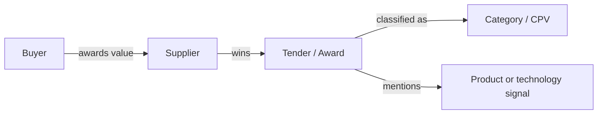

# Network Intelligence Model

## Purpose

The graph is the core analytical surface of the product.

It is not decoration. It exists because salespeople need to see relationships, not only rows.

## Why A Graph Instead Of Only Tables

Tables are good for exact checks: supplier ranking, tender detail, date, value, CPV code.

The graph answers a different kind of question:

- does this buyer repeatedly use the same suppliers,
- is the supplier network concentrated or fragmented,
- which suppliers overlap in the same categories,
- how does this buyer connect to a region or segment,
- where might a supplier be a competitor, blocker, or partner.

The product uses both surfaces. Tables provide precision. Graph layers reveal patterns.

## First Business Question

For a selected public buyer:

> Where does the money go, who receives it, and what is being delivered?

## Initial Graph Shape

The first graph focuses on cash flow:

```text
Buyer
  -> Winning Supplier
  -> Tender / Award
  -> Product, Service, Category, or Technology
  -> Value and Date
```



## Node Types

Initial node types:

- buyer,
- supplier,
- tender or award,
- category / CPV,
- technology or product signal,
- region or segment.

Later layers can introduce partners, public people or role signals, job posting signals, website signals, AI findings, and report insights.

## Edge Types

Initial edge types:

- buyer awarded tender to supplier,
- supplier won tender,
- tender belongs to category,
- tender mentions technology or product,
- buyer spent value through tender,
- supplier appears in region or segment.

Later layers can add partnership, hiring, capability, and AI-supported hypothesis edges.

## Graph Layers

The graph works as a set of layers, not one overloaded picture.

Core layers:

- cash-flow layer,
- buyer history layer,
- supplier dominance layer,
- category/technology layer,
- region layer,
- segment comparison layer,
- AI enrichment layer.

The user can change the active layer without losing the analysis session.

## Layer Progression

| Layer | User question | Product output |
| --- | --- | --- |
| Buyer cash flow | Where does this buyer's money go? | Top suppliers, values, tenders, categories |
| Supplier footprint | Where else does this supplier win? | Other buyers, regions, categories |
| Region view | Who spends and wins in this area? | Buyer and supplier rankings |
| Segment view | What does the broader market look like? | Dominant categories, suppliers, buyer clusters |
| AI enrichment | What public context changes the interpretation? | Sourced findings and hypotheses |

## Analytical Meaning

The graph helps the user see:

- repeated buyer-supplier relationships,
- supplier dominance,
- categories that drive spend,
- supplier overlap or specialization,
- competitor and partner possibilities,
- differences between account-level and region-level market structure.

## Interaction Principles

- Start simple and reveal complexity through layers.
- Let users drill down from buyer to supplier to tender.
- Let users move up from buyer to region or segment.
- Keep values, dates, and categories visible enough to preserve business meaning.
- Let the current graph state become AI research context.
- Always keep a path back to source tender records.
